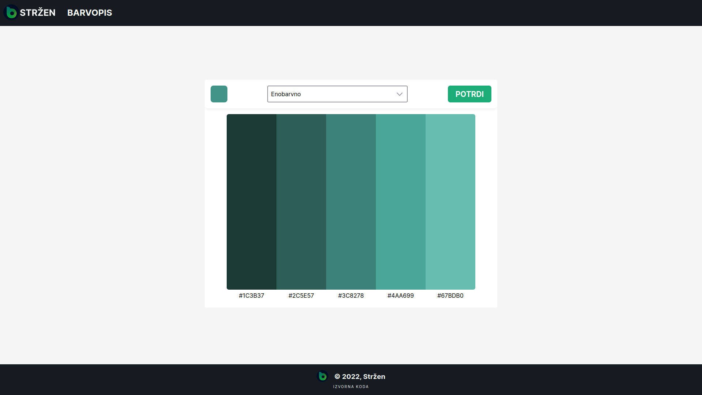

# Barvopis
Privlačno orodje za izbiro skladnih barv. Služi kot pomoč pri izbiri barv na raznovrstnih področjih.
 
Izdelan za vajo HTML/CSS/JAVASCRIPT => API. 
* S PRITISKOM NA MAJHNO SLIKO STRŽENA NA DNU STRANI SPREMENITE <bold>BARVNI NAČIN STRANI</bold>.
* S PRITISKOM NA BESEDILO POD BARVO, V ODLOŽIŠČE SHRANITE <bold>HEX VREDNOST BARVE</bold>.

<a href="https://barvopis.strzen.xyz">Predogled</a> v živo.
 
Slike:
 
Predogled -računalnik (Temni način)
 

Predogled -računalnik (Svetli način)
 

Predogled -mobitel (Temni način)
 

